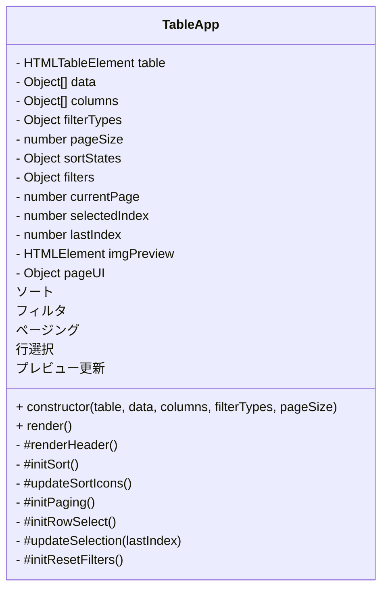
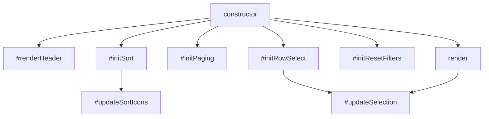
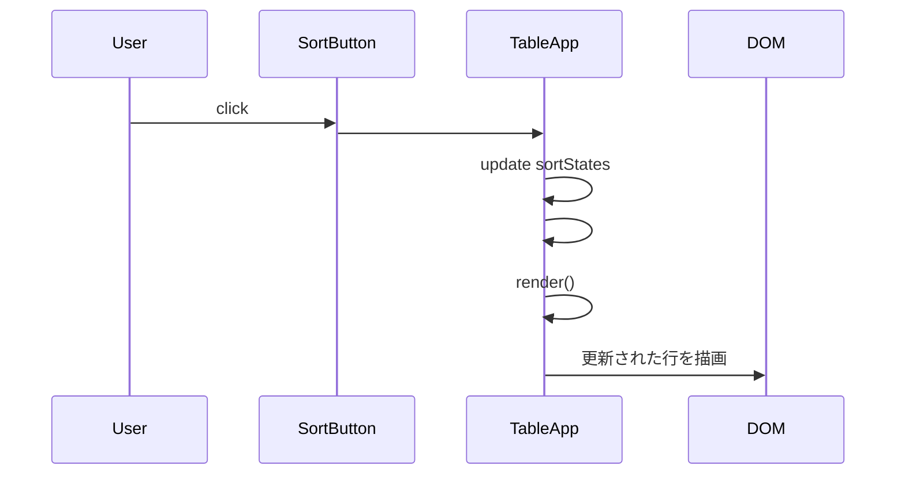

# TableApp 仕様書

## 責務分解
| 機能        | 関連メソッド                                             | 責務                    |
| --------- | -------------------------------------------------- | --------------------- |
| **ソート**   | `#initSort`, `#updateSortIcons`                    | 列単位の状態管理＋UI反映         |
| **フィルタ**  | `#renderHeader`, `#initResetFilters`, 一部`render()` | 入力要素とデータフィルタ          |
| **ページング** | `#initPaging`, 一部`render()`                        | ページ番号・サイズ・ナビゲーション     |
| **選択・移動** | `#initRowSelect`, `#updateSelection`               | 行選択状態＋スクロール補正＋プレビュー更新 |
| **描画統合**  | `render`                                           | 全体の再描画制御              |

## 概要
- HTMLページ上にデータテーブルを表示し、ページング・ソート・フィルター・行選択・画像プレビューができるWebアプリケーション。
- データは外部JSファイル（data.js）で定義し、テーブル列のフィルタータイプは filterTypes.js で定義。
- インポート/モジュールは未使用。scriptタグで順番に読み込む形。

---

## テーブル構造
- 列: ID, Name, Age, Score, Image
- データは配列オブジェクトで管理
- 固定ヘッダー: 2行（列ラベル＋フィルター入力）
- テーブルはスクロール可能（高さ300px）

---

## ページング
- デフォルト表示件数: 10件
- ページ移動:
  - Prev / Next ボタン
  - ページ番号入力
- 件数変更: 5 / 10 / 20 件表示
- ページングはループ式（最後→最初、最初→最後）

---

## ソート
- 各列ヘッダーにソートボタン付き
- ソート状態: none → asc → desc → none 循環
- 数値列は数値比較、文字列列はロケール比較
- ソートは1列のみ有効、他列はリセット

---

## フィルター
- 列ごとに以下のタイプを設定
  - match: 文字列一致（部分一致含む）
  - range: 数値範囲（min/max）
- フィルターは複数列同時適用可能
- 「フィルターリセット」ボタンで全解除
- フィルター入力はthead2行目に表示

---

## 行選択
- クリックで行選択可能
- キーボード矢印上下で行移動
- 選択行に背景色を付与
- ページ内上下移動時、選択行がスクロール範囲外にならないよう補正
  - ヘッダー2行分を考慮
  - 行末→行頭、行頭→行末移動時はスクロールもトップ／ボトムに
- 選択行の `img` 列をプレビューに表示

---

## ファイル構成
1. `index.html` : HTML本体、テーブルコンテナ・ページング・プレビュー表示
2. `style.css` : CSS全体
3. `data.js` : テーブルデータ配列
4. `filterTypes.js` : 列ごとのフィルター属性定義
5. `main.js` : テーブル操作ロジック（描画、ソート、フィルター、ページング、行選択）

---

## class diagram

---

## flowchart td

---

## sequence diagram
